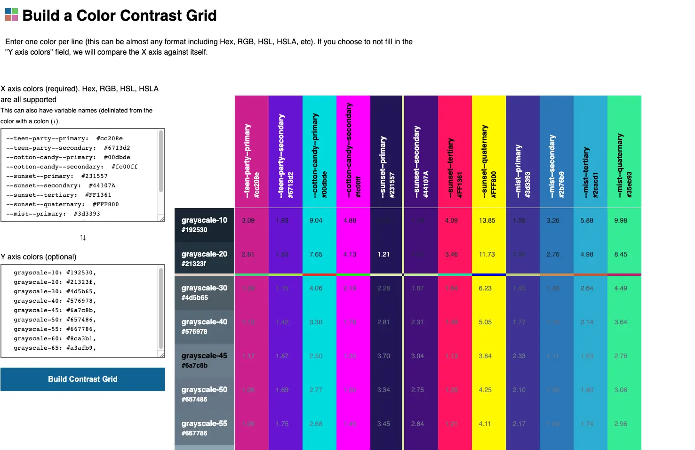

# Contrast Grid Tool

This repository is the codebase for [ContrastGrid.com](https://contrastgrid.com/).

## About

This online tool takes one or more lists of names/colors (in most common formats) and generates a grid matrix showing the colors’ contrast ratio against each other. If entering a name for the color, separate it with a colon (`:`).

This is useful when evaluating color systems, and which colors can be paired together while still remaining accessible (per [WCAG 2.1 1.4.3 Minimum Contrast Success Criterion](https://www.w3.org/WAI/WCAG21/Understanding/contrast-minimum.html)).



## Features

I had a lot of fun adding some really cool features into this:

- Extremely lightweight. Built with vanilla JavaScript and CSS.
- Saves the input colors to the URL, so the link can be shared or bookmarked (and ability to use back/forward to navigate).
- Ability to ingest lots of color formats such as hex, HSL, etc. We use the [TinyColor library](https://github.com/bgrins/TinyColor), which accepts formats such as hex, HSL, named, HSV, etc. [See here for more info](https://github.com/bgrins/TinyColor#accepted-string-input).
- Ability to specify different sets of colors on the X and Y axes (and flip them if you want).
- Easy copy/pasting of CSS with variable names (even with comments afterwards). The following code will parse perfectly:
```
--teen-party--primary: #cc208e; /* accessibile on white, not on dark */
--teen-party--secondary: #6713d2; /* accessibile on white, not on dark */
--cotton-candy--primary: #00dbde; /* not accessibile on white. Accessible on dark */
--cotton-candy--secondary: #fc00ff; /* not accessibile on white. 3.19:1 on dark */
```
- Easy copying and pasting from Sass maps into the form. The following will work perfectly (the invalid lines will be discarded):
```
$palette: (
  blue-40: #185d87,
  blue-45: #0068a8,
  blue-50: #177ab6,
  blue-55: #2284c0,
  blue-60: #37a9ef,
  blue-70: #89d2ff,
  blue-90: #cdebf9,
);
```
- Table headings (both column and row) will become “sticky” and stay in the viewport. This is useful when evaluating very large color systems which requires both horizontal and vertical scrolling.
- Super nifty "flip axis data" button (↑↓) that will flip the values in the X and Y coordinates.

## Inspiration

The concept of this site is inspired by [Eightshapes' Contrast Grid](https://contrast-grid.eightshapes.com/), as well as [Kate Deibel's Contrast Table Analyzer](https://metageeky.github.io/contrast_table_analyzer/contrast-table.html). Both of these tools are excellent, but didn’t provide exactly what I was looking for.
